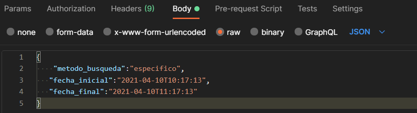

# rookie-coffee
## Consideraciones BD:
En unidad_medida: _id es string ya que almacena el codigo, ejemplo "KG","ML","L","G"

En detalle_venta: precio_historico hace referencia al precio del producto a la fecha de compra

Las llaves foráneas tomarán el nombre de la tabla a la que hacen referencia, además de tener el mismo tipo de dato que la PK de dicha tabla.

## Consideraciones paquetes/carpetas

### Controlador
Aqui se maneja la lógica del negocio
### Modelo
Abstracción de las entidades identificadas
### Base-datos
Conexión a la base de datos

## Modulos
Todas las peticiones requieren, a excepción para iniciar sesión, pasar un token válido en el encabezado con la key ``x-access-tokens``.

### **Venta**
### Consultar
Endoint: `.../venta/consultar`

Para consultar las ventas realizadas se requiere, además del token, incluir en el cuerpo de la petición el atributo `metodo_busqueda` hay 3 posibles valores:
- especifico:

    Consulta todas las ventas creadas en el rango especificado. Requiere de dos atributos: `fecha_inicial` y `fecha_final`. Estos atributos deben contener fechas en formato **ISO 8601**.
- semanal:

    Consulta todas las ventas creadas en la semana en curso (Domingo - Sábado). No requiere ningún otro atributo en el cuerpo.
- mensual:

    Consulta todas las ventas creadas en el mes en curso. No requiere ningún otro atributo en el cuerpo.

Ejemplo de una petición de ventas en un periodo específico.

### Crear
Para crear una nueva venta se requiere, además del token, un JSON con la siguiente estructura: